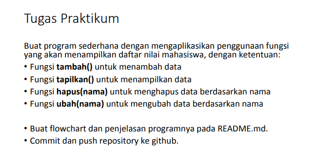
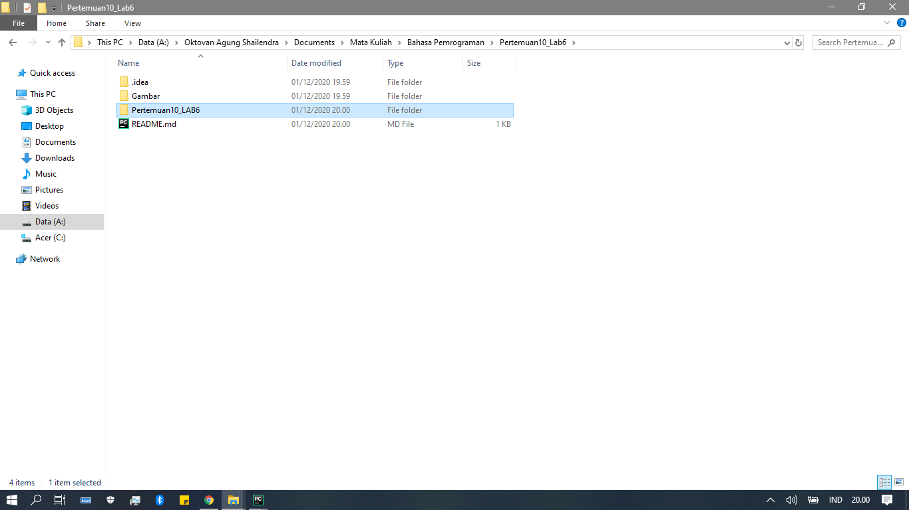
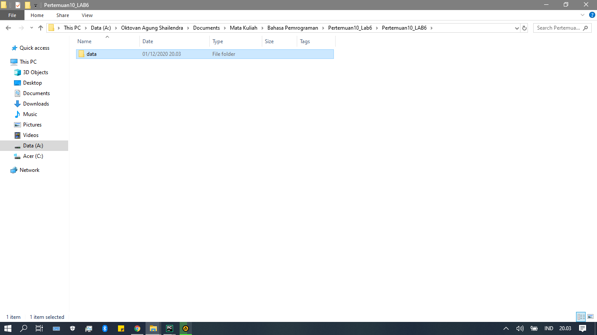
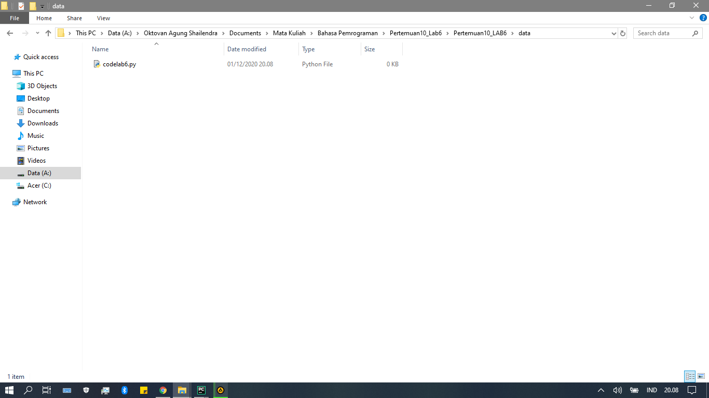
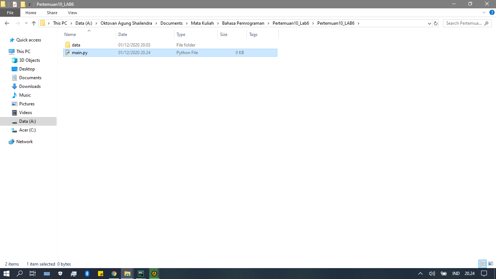
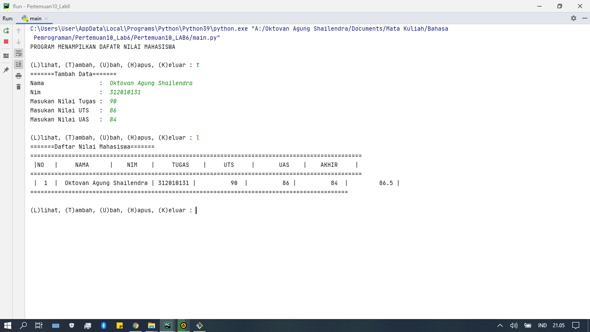

# LAB 6

-----------------------------------------------------------



Pada tugas LAB 6 ini diminta untuk membuat sebuah program untuk menambahkan data ke sebuah list dengan sistem *library root* yang nantinya akan seperti ini.

# Langkan - Langkah
* Pertama buat folder *libfary root* nya terlebih dahulu dengan nama folder **data** :


-----------------------------------------------------------

___________________________________________________________

* Setelah itu buat file python dengan nama (codelab6.py) atau yang anda inginkan didalam folder data :



* Lalu setelah itu masukan syntax dibawah ini kedalam file codelab6.py :

``` python
data = []
data = {}

def tambah():
        print("=======Tambah Data=======")
        nama    =input("Nama                :  ")
        nim     =input("Nim                 :  ")
        tugas   =int(input("Masukan Nilai Tugas :  "))
        uts     =int(input("Masukan Nilai UTS   :  "))
        uas     =int(input("Masukan Nilai UAS   :  "))
        akhir   = (0.30 * tugas) + (0.35 * uts) + (0.35 * uas)
        data[nama] = nim ,tugas, uts, uas, akhir

def lihat():
    if data.items():
        print("=======Daftar Nilai Mahasiswa=======")
        print("================================================================================================")
        print(" |NO   |     NAMA      |    NIM    |     TUGAS    |     UTS     |       UAS    |    AKHIR     | ")
        print("================================================================================================")
        i=0
        for x in data.items():
            i+=1
            print(" | {6:2}  |  {0:12s} | {1:9s} | {2:11}  | {3:11} | {4:11}  |  {5:11} |".format(x[0], x[1][0], x[1][1], x[1][2], x[1][3], x[1][4], i))
            print("============================================================================================")
    else:
        print("=======Daftar Nilai Mahasiswa======")
        print("================================================================================================")
        print(" |NO   |     NAMA      |    NIM    |     TUGAS    |     UTS     |       UAS    |    AKHIR     | ")
        print("================================================================================================")
        print("|                                      TIDAK ADA DATA                                         |")
        print("===============================================================================================")

def ubah():
        print('=======Ubah Data Mahasiswa=======')
        nama = input('Nama                :  ')
        if nama in data.keys():
            nim     =input('Nim                 :  ')
            tugas   =int(input("Masukan Nilai Tugas :  "))
            uts     =int(input("Masukan Nilai UTS   :  "))
            uas     =int(input("Masukan Nilai UAS   :  "))
            akhir   =(0.30 * tugas) + (0.35 * uts) + (0.35 * uas)
            data[nama] = nim, tugas, uts, uas, akhir
        else:
            print("Data Nilai Tidak Ada".format(nama))

def hapus():
        print("=======Hapus Data Mahasiswa=======")
        nama=input("Nama :  ")
        if nama in data.keys():
            del data[nama]
        else:
            print("Data Nilai Tidak Ada".format(nama))
```

Jika sudah memasukan semua syntax diatas jangan di run terlebih dahulu nanti file tersebut akan rusak / error.

* Selanjutnya kita buat file python baru tetapi di luar folder data untuk menjalankan file yang barusan dibuat. File yang kita buat diberi nama (main.py) karena itu akan menjadi file yang akan menjalankan file *liblrary root* yang telah kita buat sebelumnya.


* Jika sudah dibuat masukan syntax dibawah ini kedalam file main.py :
```python
from data import codelab6

print("PROGRAM MENAMPILKAN DAFATR NILAI MAHASISWA")
while True:
    print("")
    c =input("(L)lihat, (T)ambah, (U)bah, (H)apus, (K)eluar : ")
    if c.lower() == 't':
        codelab6.tambah()

    elif c.lower() == 'u':
        codelab6.ubah()

    elif c.lower() == 'l':
        codelab6.lihat()

    elif c.lower() == 'h':
        codelab6.hapus()

    elif c.lower() == 'k':
        print("Keluar")
        break

```

Nah disini di awal terdapat syntax ini :
```python
from data import codelab6
```

Fungsinya untuk menjalankan file *library root* nya yaitu dari folder (data) untuk membuka file (codelab6.py), itu penjelasan singkatnya. Kalau sudah, bisa langsung di run tetapi sebelum itu di save terlebihdahulu. Dan hasilnya akan seperti dibawah ini.



Cukup sekian tugas dari saya, jika ada kesalahan mohon di maafkan.

# TERIMA KASIH